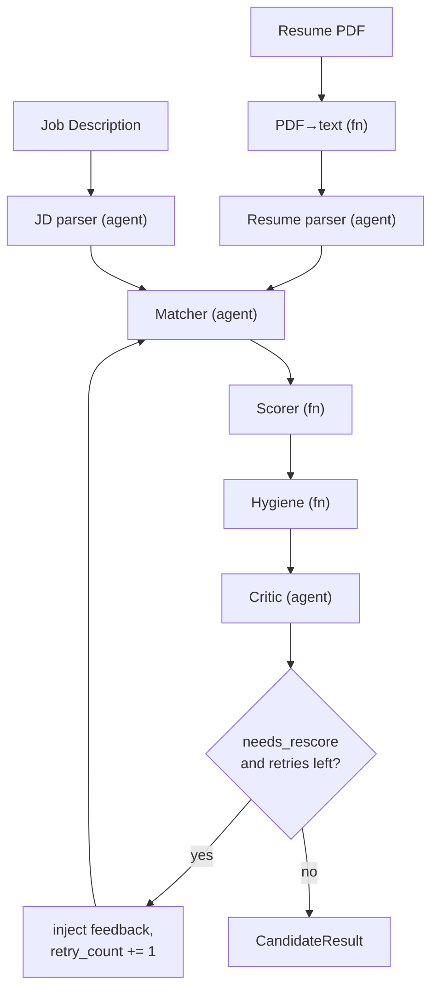

# CV-Align-Agents — Architecture Deep Dive (Interview Companion)

This document is written for a long-form technical interview where you walk an
interviewer through the system end to end. It starts by justifying the problem,
then explains every design decision **in the order you'd actually reason about
them**, with emphasis on architecture, trade-offs, and the "why not X"
alternatives interviewers love to probe.

How to use it: read top-to-bottom once to internalise the narrative. In the
interview, you can enter at any section. Each section ends with the **one-liner**
you'd say out loud and the **follow-ups** an interviewer is likely to ask.

---

## Table of contents

1. [The problem and why it's hard](#1-the-problem-and-why-its-hard)
2. [Why a single LLM call is the wrong solution](#2-why-a-single-llm-call-is-the-wrong-solution)
3. [Design philosophy: functions vs. agents](#3-design-philosophy-functions-vs-agents)
4. [The architecture at a glance](#4-the-architecture-at-a-glance)
5. [The shared state — the contract that makes it composable](#5-the-shared-state)
6. [Stage 1 — PDF extraction (deterministic)](#6-stage-1--pdf-extraction)
7. [Stage 2 & 3 — Parser agents and structured output](#7-stages-2--3--the-parser-agents)
8. [Stage 4 — The matcher (the core differentiator)](#8-stage-4--the-matcher)
9. [Stage 5 — The deterministic scorer](#9-stage-5--the-deterministic-scorer)
10. [Stage 6 — The hygiene checker](#10-stage-6--the-hygiene-checker)
11. [Stage 7 — The critic and the self-correction loop](#11-stage-7--the-critic--self-correction)
12. [Orchestration with LangGraph](#12-orchestration-with-langgraph)
13. [The two-persona screening layer](#13-the-two-persona-screening-layer)
14. [The LLM provider abstraction](#14-the-llm-provider-abstraction)
15. [Configuration and the settings layer](#15-configuration-and-settings)
16. [The API layer and dependency injection](#16-the-api-layer)
17. [Persistence](#17-persistence)
18. [The frontend](#18-the-frontend)
19. [Testing strategy](#19-testing-strategy)
20. [Deployment](#20-deployment)
21. [Failure modes and resilience](#21-failure-modes-and-resilience)
22. [What I'd do next / how it scales](#22-what-id-do-next)
23. [Rapid-fire interview Q&A](#23-rapid-fire-qa)

---

## 1. The problem and why it's hard

**The problem.** Given one or more resumes (as PDFs) and a job description (JD),
produce a *fit assessment*: how well each candidate matches the role, *why*, and
— for a candidate improving their own CV — *what to change*.

This shows up in two real workflows:

- **Recruiter:** "I have 200 applicants for this role. Rank them and tell me why."
- **Candidate:** "Here's the job I want. Score my CV and tell me how to improve it."

**Why it's genuinely hard:**

1. **Unstructured input.** A PDF is a visual layout, not data. Two resumes with
   identical content can have wildly different byte structure. You must recover
   structure (skills, experience, projects) before you can reason.
2. **Fuzzy matching.** "Built REST APIs in Python" should match a requirement for
   "backend development experience" even though no keyword overlaps. Pure
   keyword/ATS matching misses this; it's a semantic problem.
3. **Context-dependent.** The *same* resume is a strong fit for one job and weak
   for another. There's no universal "resume score" — fit is relative to a JD.
4. **Explainability is mandatory.** A number alone is useless and, in hiring,
   arguably unethical. A recruiter needs evidence; a candidate needs actionable
   reasons. The system must show its work.
5. **Cost and latency.** LLM calls cost money and time. At 200 resumes you can't
   be naive about how many calls you make.

> **One-liner:** "It's an unstructured-input, semantic-matching problem where the
> output has to be *explainable* and the scoring has to be *relative to a specific
> job* — and it has to stay cheap at batch scale."

**Follow-ups you should expect:** *"Why not just use keyword matching / an ATS?"*
→ because it fails point 2; equivalent experience with different wording scores
zero. *"Why is explainability non-negotiable?"* → hiring decisions need
auditable justification, and candidate feedback is the whole value prop on that
side.

---

## 2. Why a single LLM call is the wrong solution

The naive solution is one big prompt: "Here's a resume and a JD, return a score
from 0–100." I deliberately rejected this. Here's the reasoning, because the
*rejection* is the most important architectural decision in the project.

**Problems with the monolithic prompt:**

- **It's a black box.** If the score is wrong, you can't tell *which part* of the
  reasoning failed — parsing? matching? weighting? You can't debug a single
  opaque call.
- **You can't improve one thing without risking everything.** Tweaking the prompt
  to fix scoring might break extraction. There's no separation of concerns.
- **The "score" is non-deterministic and unauditable.** The LLM might weight
  skills 40% one call and 25% the next. You can't prove the math or tune it.
- **No reuse.** If you want to match one resume against five jobs, the monolith
  re-reads and re-parses the resume five times.
- **It conflates deterministic and probabilistic work.** Computing a weighted
  average does not need an LLM — but the monolith makes the LLM do it, badly and
  expensively.

**The alternative I chose:** decompose into a **pipeline of specialised stages**,
each with a single responsibility, each independently inspectable and testable.
This is the same instinct as breaking a god-function into small functions — but
applied to an LLM workflow.

> **One-liner:** "A single prompt is a black box you can't debug, can't tune, and
> can't prove. I decomposed it into stages so each one is inspectable, testable,
> and improvable in isolation — and so deterministic work stays deterministic."

**Follow-up:** *"Isn't a pipeline more LLM calls and therefore more expensive?"*
→ Net, no: the deterministic stages (scoring, hygiene) replace LLM work with free
code, and the orchestration layer (Section 13) actively minimises calls in batch
mode. You trade a few more calls per resume for debuggability and the ability to
*cut* calls where they don't add value.

---

## 3. Design philosophy: functions vs. agents

The governing rule of the whole system:

> **Use a plain function when the task is deterministic. Use an LLM agent only
> when the task genuinely needs judgment.**

This single principle drives cost, reproducibility, and testability.

| Task | Needs judgment? | Implementation |
|------|-----------------|----------------|
| PDF → text | No | function (`pypdf`) |
| Resume text → structured fields | Yes (section boundaries, what's a "skill") | **agent** |
| JD text → structured requirements | Yes (required vs nice-to-have) | **agent** |
| Resume ↔ JD section matching | Yes (semantic fit) | **agent** |
| Sub-scores → final score | No (arithmetic) | function |
| Resume hygiene (links, numbers) | No (rules) | function |
| Gaps / suggestions / verdict | Yes (natural language judgment) | **agent** |

**Why this matters technically:**

- **Determinism where it counts.** The final score is a pure function of the
  matcher's sub-scores. Same input → same output, every time. You can unit-test
  it with exact assertions (`assert score == 0.62`).
- **Cost.** Three of seven stages are free (no tokens). Hygiene alone would be 1
  extra LLM call per resume if done naively; as a function it's zero.
- **Tunability without prompt-fiddling.** Want skills to matter more? Change a
  weight constant — no prompt engineering, no re-validation of LLM behaviour.

> **One-liner:** "I treat the LLM as a scarce, non-deterministic resource. If code
> can do the job, code does the job. The LLM is reserved for the three places that
> truly need judgment: parsing, matching, and critique."

---

## 4. The architecture at a glance



The data path is: **raw inputs → structured inputs → per-section match →
deterministic score → hygiene → critique → (optional retry) → result.**

Three things to notice, because they're the architecturally interesting parts:

1. **The matcher is reachable from two directions** — the normal forward edge and
   the self-correction loop. That single back-edge is what makes this a *graph*,
   not a straight pipeline, and it's why LangGraph earns its place (Section 12).
2. **Scoring and hygiene sit between two agents** but are themselves pure
   functions — the deterministic core is sandwiched inside the agentic flow.
3. **The critic gates the loop**, but the *decision* to loop is made in code, not
   by the LLM (Section 11).

---

## 5. The shared state

Every stage communicates through one typed object, `PipelineState`. This is the
backbone — get the state model right and the pipeline composes cleanly; get it
wrong and every stage needs bespoke glue.

```python
class PipelineState(BaseModel):
    # Inputs
    resume_raw: ResumeRaw
    jd_raw: JDRaw
    config: PipelineConfig

    # Accumulated as stages run (all Optional, filled in order)
    resume_structured: StructuredResume | None = None
    jd_structured:     StructuredJD | None = None
    match_result:      MatchResult | None = None
    final_score:       FinalScore | None = None
    hygiene:           HygieneReport | None = None
    critique:          Critique | None = None

    # Self-correction bookkeeping
    retry_count: int = 0

    # Explainability
    trace:  list[TraceEntry] = []
    errors: list[str] = []
```

**Key design choices and the reasoning:**

- **Pydantic, not dicts.** Every inter-stage payload is a validated model. If the
  matcher emits a malformed sub-score, it fails *at the boundary* with a clear
  error, not three stages later with a cryptic `KeyError`. The state is also
  self-documenting — you can read the class and know the entire data flow.
- **Fields are `Optional` and filled progressively.** The state starts with only
  inputs; each stage populates its slice. This makes partial/failed runs
  representable (a run that died after scoring still has a valid, inspectable
  state) and lets `CandidateResult.from_state` degrade gracefully.
- **`retry_count` lives in the state, not the orchestrator.** LangGraph nodes are
  stateless functions; all loop bookkeeping must travel *in* the state. This is a
  deliberate consequence of the framework's design and keeps nodes pure.
- **The `trace` is a first-class field.** Every stage appends a `TraceEntry`
  (`agent`, `timestamp`, `note`). This is the explainability/audit backbone — at
  the end you have an ordered log of exactly what ran and what each stage decided.
- **A separate `CandidateResult` for output.** I don't return `PipelineState` to
  API clients — it carries internal bookkeeping (raw text, retry counts). A clean
  `CandidateResult.from_state()` projection decouples the public contract from the
  internal machine. Classic "don't leak your internal model" discipline.

> **One-liner:** "There's one typed, progressively-filled state object that every
> stage reads and writes. Pydantic validates it at each boundary, loop state lives
> inside it because nodes are stateless, and a separate output model keeps internal
> bookkeeping from leaking to clients."

**Follow-up:** *"Why does retry state live in the state object?"* → because
LangGraph nodes are pure functions of the state; there's no node-local memory
across a loop, so the only place to track "have I retried?" is the state itself.

---

## 6. Stage 1 — PDF extraction

A deterministic function (`pdf.py`) using `pypdf`. It accepts **either a file
path or raw bytes** — bytes are what the API receives from an upload, paths are
what the CLI tools use. It collapses excessive blank lines and returns plain text.

**Technical points worth raising:**

- **Bytes-or-path via `BytesIO`.** The upload path never touches disk; the
  uploaded bytes are wrapped in `BytesIO` and handed to `pypdf`. No temp files,
  no cleanup, no race conditions.
- **Explicit error taxonomy.** A missing file raises `FileNotFoundError`; a
  malformed PDF raises a custom `PDFExtractionError`. The API maps these to a
  `422` with a per-file message, so the user learns *which* file failed and why.
- **Graceful on image-only PDFs.** A scanned PDF yields little/no text rather than
  crashing; downstream, an empty resume simply produces an empty structured
  result (the parser short-circuits without an LLM call).

> **One-liner:** "Deterministic, accepts bytes or path so uploads never hit disk,
> and has an explicit error taxonomy that the API surfaces per-file."

---

## 7. Stages 2 & 3 — the parser agents

Two agents, same pattern: `parse_resume` (text → `StructuredResume`) and
`parse_jd` (text → `StructuredJD`). This is where unstructured text becomes data.

**The single most important technique here: structured output.**

```python
extractor = llm.with_structured_output(StructuredResume)
result = extractor.invoke([SystemMessage(...), HumanMessage(resume_text)])
```

`with_structured_output(Schema)` binds the Pydantic schema to the model so the
LLM returns a **validated object**, not free text. Under the hood the provider
uses function-calling / JSON-schema-constrained decoding. This eliminates the
single most common failure mode in LLM apps — fragile JSON parsing and
"the model added prose around the JSON" — entirely.

**Other technical decisions:**

- **`temperature=0.0` everywhere.** Extraction and scoring should be as
  reproducible as a probabilistic model allows. I set temperature 0 by default in
  the client factory.
- **Prompts forbid invention.** The system prompt explicitly says "extract only
  what's present; never infer." Hallucinated skills would poison the match. Rules
  like "split comma-separated skills into individual items" make the structured
  output regular.
- **Empty-input short-circuit.** If the text is blank, the function returns an
  empty model *without calling the LLM* — a small but real cost/robustness win,
  and it's unit-tested with a "boom" LLM that asserts it's never invoked.
- **Defensive dict coercion.** Some providers return a dict rather than the model
  instance; the code re-validates with `Model.model_validate(result)` so behaviour
  is provider-independent.

> **One-liner:** "Both parsers use `with_structured_output` to get a validated
> Pydantic object straight from the model — no JSON parsing, no repair. Temperature
> zero, prompts that forbid invention, and an empty-input short-circuit that skips
> the LLM entirely."

**Follow-up:** *"What if the LLM returns invalid structured output?"* → Pydantic
validation throws at the boundary; in practice schema-constrained decoding makes
this rare, and the dict-coercion path handles provider quirks.

---

## 8. Stage 4 — the matcher

This is the **core differentiator** and the most interesting agent. It takes the
structured resume + structured JD and produces a `MatchResult`: one `SubScore`
per section (skills, experience, projects, education), each with a 0–1 score,
**quoted evidence**, and a one-sentence reason — plus an
`overall_evidence_quality` signal.

**Why per-section sub-scores instead of one number?**

- **Granularity = explainability.** "0.30 on experience because the role wants 3
  years and the candidate has a 3-month internship" is actionable. "0.58 overall"
  is not.
- **Separation from weighting.** The matcher judges *fit per section*; it does not
  decide how much each section *matters*. That's the scorer's job (Section 9).
  Keeping these separate means I can re-weight without touching the prompt, and
  the LLM never has to do arithmetic.
- **Evidence is a first-class field.** Each sub-score carries the resume snippets
  that justify it. This is what powers the "show your work" requirement from
  Section 1.

**The `overall_evidence_quality` signal** is subtle and worth calling out: it's
the matcher self-reporting how strong/unambiguous the evidence was. It later feeds
the self-correction decision (Section 11) — if the evidence was weak, we're more
inclined to re-evaluate.

**Defensive normalisation.** The LLM is asked for exactly one entry per section,
but I don't trust it to always comply. `_normalise_sections` de-duplicates
(keeps the first per section) and zero-fills any missing section, so downstream
the scorer *always* sees a complete, predictable set of four. This is the kind of
"don't trust the model's structure, enforce your invariants in code" discipline
that separates a toy from a robust system.

**Feedback injection.** The matcher takes an optional `feedback` parameter. On a
self-correction retry, the critic's suggestions are injected into the prompt
("a previous pass was low-confidence; address this feedback and re-evaluate"),
so the second attempt is better grounded rather than a blind re-roll.

> **One-liner:** "The matcher scores each section independently against the JD with
> quoted evidence, and self-reports evidence quality. It deliberately doesn't decide
> weights — that stays deterministic. And I enforce the one-per-section invariant in
> code rather than trusting the model."

**Follow-ups:** *"How do you stop it inflating scores?"* → prompt instructs
evidence-driven scoring and "don't reward skills the JD didn't ask for"; evidence
is mandatory, so an inflated score with no evidence is visibly suspect (and the
critic can catch it). *"Why not embeddings + cosine similarity for matching?"* →
see Section 23; short version: embeddings give you a similarity number with no
reasoning or evidence, which fails the explainability requirement.

---

## 9. Stage 5 — the deterministic scorer

A pure function. No LLM. This is the piece that makes the final number trustworthy.

```
final = Σ (weight_i × sub_score_i)   for i in {skills, experience, projects, education}
```

Default weights: skills 0.35, experience 0.30, projects 0.25, education 0.10.

**Why this is a function and not an agent — the full argument:**

- **Reproducibility.** Given a `MatchResult`, the score is identical every call.
  You can write `assert score == 0.62`. You cannot do that with an LLM.
- **Provability.** In an interview or to a recruiter I can show the arithmetic.
  The response includes `weights_used` and the per-section `breakdown`, so the
  number is fully reconstructable.
- **Tunability.** Weights are config, overridable per request. The validator
  **normalises any override to sum to 1.0** (and drops unknown keys, and falls
  back to defaults if someone passes all zeros). That normalisation is what
  *guarantees* the final score stays in `[0, 1]` regardless of what weights a
  caller throws at it — a nice invariant to be able to state confidently.
- **A final clamp** against floating-point drift keeps it strictly in range.

This stage is ~30 lines and has 7 dedicated unit tests (perfect match → 1.0, zero
→ 0.0, the manual weighted-sum check, missing-section handling, custom weights,
determinism). It's the easiest stage to get exactly right *because* it's
deterministic — which is precisely the point.

> **One-liner:** "The final score is a pure weighted sum with normalised weights,
> so it's reproducible, provable, tunable, and guaranteed to land in [0,1]. I moved
> the one piece that must be trustworthy out of the LLM's hands entirely."

---

## 10. Stage 6 — the hygiene checker

A deterministic, zero-LLM module of objective resume checks, independent of the
JD. Inspired by the bonus/deduction idea in HackerRank's open-source hiring-agent,
but a clean-room implementation (no copied code).

**What it checks (all rule-based / regex):** missing email, GitHub, LinkedIn;
placeholder URLs (`example.com`, `TODO`); thin or missing skills; missing
projects; generic project names ("Project 1"); experience bullets with no numbers
(unquantified impact); missing education. It returns a 0–1 hygiene score (each
issue applies a severity-weighted penalty), a list of issues, and positives.

**The key architectural decision: hygiene is *advisory*, not part of the score.**

I deliberately keep hygiene **out** of the JD-match score. Reasoning: the match
score should mean exactly one thing — "fit for this job." Folding in "your resume
has no LinkedIn link" would muddy that signal. Instead, hygiene feeds the critic's
suggestions and is surfaced to the candidate as a separate number. This keeps two
orthogonal concerns — *job fit* and *resume quality* — cleanly separated.

**Why this stage exists at all** (a great thing to volunteer in an interview): it
showcases the functions-vs-agents philosophy concretely. "Does this resume have a
GitHub link?" needs zero intelligence — a regex answers it deterministically and
for free. Doing it with an LLM would be slower, costlier, and *less* reliable.

> **One-liner:** "Deterministic, regex-based resume-quality checks that are
> advisory only — they inform feedback but never touch the job-fit score, because I
> want that score to mean exactly one thing."

---

## 11. Stage 7 — the critic & self-correction

The final agent. It reviews everything — JD, resume, per-section scores with
evidence, final score, and the hygiene report — and produces `gaps`,
`suggestions`, a `verdict` (strong/moderate/weak fit), and a
`confidence_in_scoring`.

**The most important design decision in this stage: the self-correction *decision*
is deterministic, not made by the LLM.**

```python
needs_rescore = (
    out.confidence_in_scoring < threshold
    or match_result.overall_evidence_quality < threshold
)
```

The LLM provides *judgment inputs* (its confidence, the matcher's evidence
quality), but the **rule** that decides whether to loop lives in code. I even
structured this in the types: the LLM is asked for an internal `_CriticLLMOutput`
schema that **does not contain `needs_rescore`** — that field is computed
afterward and added to the public `Critique`. So the model literally cannot decide
to loop; it can only supply the numbers the rule consumes.

**Why this matters:**

- **Predictability.** Loop behaviour is governed by a tunable threshold
  (default 0.6), not the LLM's mood. I can reason about exactly when a retry fires.
- **Tunability.** Lower the threshold → fewer retries (cheaper); raise it → more
  careful (costlier). One knob, no prompt changes.
- **Termination.** Combined with the retry cap (Section 12), the loop provably
  terminates.

**The loop itself:** if `needs_rescore` and we haven't hit `max_retries`
(default 1), control returns to the matcher with the critic's suggestions injected
as feedback. One careful re-evaluation, then we finalise no matter what.

> **One-liner:** "The critic gives judgment, but the decision to re-evaluate is a
> deterministic threshold in code — I even kept `needs_rescore` out of the LLM's
> output schema so the model can't decide to loop. That makes the agentic loop
> predictable, tunable, and guaranteed to terminate."

**Follow-up (very common):** *"Why cap retries at 1? Why not loop until
confident?"* → unbounded loops on a probabilistic model are a cost and latency
risk and rarely converge meaningfully past one pass; one well-grounded retry
captures most of the benefit. The cap is config, so it's a one-line change if
evidence ever justified more.

---

## 12. Orchestration with LangGraph

The stages are wired into a `StateGraph` whose nodes are the stage functions and
whose edges define the flow. Most edges are linear; the interesting one is a
**conditional edge** after the critic.

```python
graph.add_conditional_edges(
    "critic",
    route_after_critic,          # returns "retry" or "end"
    {"retry": "prepare_retry", "end": END},
)
graph.add_edge("prepare_retry", "match")   # the back-edge
```

**Why LangGraph and not just calling functions in sequence?** This is *the*
question an interviewer asks, and the honest answer is the strong one:

- A purely linear pipeline genuinely *doesn't* need a graph framework — you'd be
  right to call plain functions. **The justification for LangGraph is the
  conditional self-correction edge.** The moment you have a node that can route
  back to an earlier node based on runtime state, you have a state machine, and a
  graph framework gives you that cleanly: explicit nodes, explicit conditional
  routing, centralised state threading, and a compiled, inspectable graph.
- It also gives **state management for free** — each node returns a partial
  update dict and the framework merges it into the state, so nodes stay pure
  functions of the incoming state.

**Two concrete technical details I hit and solved:**

1. **Node names can't collide with state field names.** I originally named the
   hygiene node `hygiene`, which clashed with the `hygiene` state field; LangGraph
   raised `'hygiene' is already being used as a state key`. I renamed the node to
   `check_hygiene`. Good "I read the framework's constraints" story.
2. **Trace accumulation without a custom reducer.** Each node returns
   `{"trace": state.trace + [new_entry]}` — it reads the current trace and returns
   an extended copy. This accumulates the audit log across nodes (and across loop
   iterations) without needing a custom channel reducer. Idempotent parser nodes
   (they early-return `{}` if already parsed) mean a retry doesn't re-parse.

**Idempotent nodes enable JD reuse.** The parser nodes check "am I already
populated?" and skip if so. This is what lets the batch layer parse the JD once
and inject it into every resume's state — the per-resume JD-parse node sees it's
already set and no-ops. Clean, and it saves N-1 JD parses on a batch of N.

> **One-liner:** "LangGraph earns its place because of exactly one edge — the
> conditional loop back to the matcher. That back-edge makes this a state machine,
> and the framework gives me explicit nodes, conditional routing, and automatic
> state threading. A linear pipeline wouldn't need it, and I'll say so."

---

## 13. The two-persona screening layer

Above the per-resume graph sits `screen()` — the orchestration that turns "run one
resume" into "run a candidate or a recruiter request." This is where concurrency
and cost-control live.

```python
config = config or PipelineConfig()
jd_structured = parse_jd(jd, llm=llm)          # parse the JD ONCE
pipeline = build_pipeline(llm=llm)

fast = config.mode == "recruiter" and config.critic_mode == "fast"
run_config = config.model_copy(update={"enable_critic": not fast})

states = await asyncio.gather(                 # all resumes concurrently
    *(_run_one(pipeline, r, jd, jd_structured, run_config) for r in resumes)
)

if fast:                                        # critique only the top-K
    ranked = sorted(states, key=score, reverse=True)
    for s in ranked[:config.critic_top_k]:
        s.critique = critique(...)

candidates = sorted(map(CandidateResult.from_state, states),
                    key=lambda c: c.score, reverse=True)
```

**The three techniques here, each with a reason:**

1. **Parse the JD once.** The JD is identical across all resumes in a request.
   Parsing it once and injecting it (idempotent nodes, Section 12) saves N-1 LLM
   calls on a batch of N. On 200 resumes that's 199 calls saved.
2. **Concurrency via `asyncio.gather`.** Each resume's pipeline is independent, so
   they run concurrently. `pipeline.invoke` is blocking, so I push it off the
   event loop with `asyncio.to_thread` inside `_run_one` — that's what makes the
   gather actually parallel rather than serial-with-extra-steps. Per-resume
   independence also means one bad resume can't poison the others, and each is
   independently retryable.
3. **fast vs full critic — the cost lever.** In `full` mode the critic runs inline
   per resume. In `fast` mode I flip `enable_critic=False` (a conditional graph
   edge skips the inline critic), score everyone first, *then* critique only the
   top-K. On a 200-resume batch with `critic_top_k=5`, that's ~195 critic calls
   saved. This is the "I thought about cost at scale" story.

**Why per-resume rather than one giant prompt with all resumes?** Three reasons:
debuggability (one failure is isolated), no long-context recency bias (LLMs over-
weight items near the end of a long prompt), and natural parallelism. This mirrors
how real ranking systems (Greenhouse, Lever) score candidates independently then
rank, rather than asking a model to compare 200 resumes in one shot.

> **One-liner:** "The batch layer parses the JD once, runs resumes concurrently
> with asyncio, and in fast mode scores everyone but critiques only the top-K —
> turning an O(N) critic cost into O(K). Per-resume isolation also kills long-
> context recency bias and makes failures local."

---

## 14. The LLM provider abstraction

Agents never import a concrete LLM class. They call a factory:

```python
def get_chat_model(*, temperature=0.0, settings=None, **kwargs) -> BaseChatModel:
    provider = settings.llm_provider.strip().lower()
    if provider not in DEFAULT_MODELS:
        raise LLMConfigError(...)
    model = settings.llm_model or DEFAULT_MODELS[provider]
    if provider == "gemini": return _build_gemini(...)
    if provider == "groq":   return _build_groq(...)
```

**The architecture principle: dependency inversion.** Every agent depends on
LangChain's abstract `BaseChatModel`, never on `ChatGoogleGenerativeAI` or
`ChatGroq`. Because all providers implement the same interface — crucially
including `.with_structured_output()` — swapping providers is a **config change
with zero code changes** in any agent.

**Technical details:**

- **Lazy, per-provider imports.** `langchain_google_genai` is only imported inside
  `_build_gemini`, `langchain_groq` only inside `_build_groq`. A Groq-only
  deployment doesn't need the Gemini package installed, and vice versa.
- **Clear config errors.** Missing key → `LLMConfigError` with the exact env var
  and where to get a key. The API maps this to a `503`.
- **`temperature=0.0` default** is set here, centrally, so every agent inherits
  deterministic decoding unless it opts out.

**This abstraction paid off for real, not hypothetically.** Mid-project the Gemini
free tier turned out to be ~20 requests/day — too low for a public demo. Switching
the entire system to Groq (Llama 3.3 70B, ~14,400/day) was *one environment
variable*. No agent code changed. That's the abstraction proving its worth under a
real constraint, which is a far stronger interview story than "I added it for
flexibility."

> **One-liner:** "Agents depend on the abstract `BaseChatModel`, not a concrete
> provider, so switching LLMs is a one-env-var change. I proved it: when Gemini's
> free tier was too small, I moved the whole app to Groq without touching a single
> agent."

---

## 15. Configuration and settings

`settings.py` uses `pydantic-settings` to load typed config from environment /
`.env`: provider, model, API keys, DB path, log level. It's wrapped in
`@lru_cache` so the `.env` is read once and the same `Settings` instance is reused.

`PipelineConfig` is the *per-request* config (mode, critic_mode, critic_top_k,
weights, max_retries, confidence_threshold). The split is intentional:
**`Settings` = deployment-level (env), `PipelineConfig` = request-level (API
params).** The validator on `PipelineConfig` is where weight normalisation lives,
so the `[0,1]` score guarantee is enforced at config-construction time, before any
scoring runs.

> **One-liner:** "Two config layers: env-level Settings (cached, read once) and
> per-request PipelineConfig whose validator normalises weights up front, so the
> score-range invariant holds before a single stage runs."

---

## 16. The API layer

FastAPI. Endpoints: `GET /` (UI), `GET /health`, `POST /screen`, `GET /runs/{id}`,
`GET /runs`, plus `/docs` (auto Swagger).

**Architecturally interesting bits:**

- **Dependency injection for the LLM and the store.** `get_llm` and `get_store`
  are FastAPI dependencies. In production they return the real provider / a
  file-backed SQLite store; in tests I override them via
  `app.dependency_overrides` to inject a **fake LLM** and a temp-file DB. This is
  what makes the entire API testable offline with zero network/keys (Section 19).
- **Validation-first, layered error mapping.** I build `PipelineConfig` *before*
  reading files, so a bad `mode` fails fast with `422`. Each PDF is extracted in a
  loop with a per-file `422` on failure. `LLMConfigError` from a missing key maps
  to `503`. The client always gets a specific, actionable status + message.
- **Async endpoint, off-thread blocking work.** The endpoint is `async`;
  CPU/IO-blocking work (`store.save`, the blocking `pipeline.invoke`) is pushed to
  threads so the event loop isn't starved.
- **Multipart upload.** `resumes: list[UploadFile]` accepts one or many PDFs in a
  single request — the same endpoint serves both personas.

> **One-liner:** "FastAPI with the LLM and the datastore behind dependency
> injection, which is what lets me test the whole API offline with a fake model.
> Validation happens before file I/O, and every failure maps to a specific status
> code with an actionable message."

---

## 17. Persistence

`storage/runs.py` — a small `RunStore` over the standard-library `sqlite3` (no
extra dependency). Each run is saved as a JSON row keyed by a UUID `run_id`, with
`created_at`, `mode`, `job_title`, and `n_candidates` columns for cheap listing.

**Technical choices:**

- **Stdlib sqlite3, fresh connection per operation.** SQLite connections aren't
  safe to share across threads; opening one per operation makes the store safe to
  call from FastAPI's worker threads without a connection pool.
- **Store the full result as JSON.** I'm not doing relational queries over
  candidates; I'm storing/retrieving whole runs. A JSON blob keyed by `run_id`
  with a few indexed summary columns is the right weight — no premature schema.
- **`:memory:` is explicitly rejected** with a helpful error, because a per-
  operation-connection design would silently lose data with an in-memory DB. That
  guardrail prevents a subtle footgun.

> **One-liner:** "A tiny SQLite store, stdlib only, one connection per op so it's
> thread-safe under FastAPI. Runs are stored as JSON blobs keyed by UUID with a few
> summary columns for listing — right-sized, no premature schema."

---

## 18. The frontend

A dependency-free single-page UI (`index.html`, `style.css`, `app.js`) served by
FastAPI itself at `/`, with assets under `/static`. No React, no build step.

**Why static, server-served, no framework:**

- **Single artifact.** The UI ships *inside* the same package/container as the API
  (wired via `package-data`). One deploy, one origin — no CORS, no separate
  frontend host, no build pipeline.
- **Vanilla JS, XSS-safe.** All dynamic rendering uses `textContent`, never
  `innerHTML`, on data that ultimately derives from user-uploaded resumes — so a
  resume containing `<script>` can't inject anything.
- **It's a demo UI, not the product.** The product is the pipeline. The UI is the
  thinnest possible layer to make the pipeline tangible (upload, toggle mode, see
  score/gaps/suggestions with breakdown bars). Spending a React toolchain here
  would be effort in the wrong place.

> **One-liner:** "A zero-build static UI served by the API itself, so it's one
> artifact with no CORS and no separate host. Vanilla JS rendered via textContent
> for XSS safety. The pipeline is the product; the UI is a deliberately thin layer."

---

## 19. Testing strategy

**70 tests, fully offline, plus live verification.** The strategy is the
interesting part.

- **A fake LLM that mimics the real interface.** The tests inject a fake whose
  `with_structured_output(Schema).invoke()` returns canned models. This exercises
  the *real* agent code paths — prompt construction, normalisation, dict coercion,
  feedback injection — without a single network call or API key. CI is fast,
  deterministic, and free.
- **A routing fake for the graph/orchestration tests.** A smarter fake dispatches
  by the requested schema, so one fake can drive parser + matcher + critic through
  a full pipeline run — letting me test the self-correction loop, the JD-parsed-
  once invariant, and fast-mode top-K critiquing as pure offline tests.
- **Determinism tests for the functions.** The scorer and hygiene have exact-value
  assertions (`assert score == 0.62`) — only possible *because* they're
  deterministic, which validates the whole functions-vs-agents thesis.
- **API tests via `TestClient` + dependency overrides.** The full HTTP path
  (multipart upload → screen → persist → retrieve) is tested with a real (tiny,
  hand-generated) PDF and the fake LLM injected through DI.
- **Live verification at every stage.** Beyond the offline suite, every agent was
  run against a real LLM during development, and the deployed app was smoke-tested
  end-to-end over HTTP.

> **One-liner:** "Every stage is tested offline by injecting a fake LLM through the
> same interface the real one implements, so I test real code paths with no network
> or keys. The deterministic stages get exact-value assertions. Then I verified
> every stage live and smoke-tested the deployed app over HTTP."

**Follow-up:** *"How do you test non-deterministic LLM behaviour?"* → I don't test
the model; I test *my code around it* with a fake that returns controlled outputs.
The model's quality is validated separately by live runs.

---

## 20. Deployment

Containerised (`Dockerfile`) and deployed to **Hugging Face Spaces** (Docker SDK),
running on Groq. The README front-matter doubles as the Space config; the same
container serves API + UI + SQLite.

**Points to raise:**

- **One container, whole app.** API, static UI, and the SQLite file all live in
  one image — trivial to run anywhere Docker runs.
- **`$PORT`-aware, src-layout editable install.** The image installs the package
  (`pip install -e ".[groq]"`) and launches uvicorn binding `$PORT`, which is how
  PaaS hosts inject the port.
- **Ephemeral-disk-aware.** Free hosts have ephemeral disk, so the SQLite path
  defaults to `/tmp/runs.db`; run history resets on redeploy, which is fine for a
  demo and a conscious trade-off rather than an oversight.
- **HF Spaces chosen deliberately.** Its 48-hour idle-sleep (vs Render's 15 min)
  keeps a portfolio link warm for visitors, and an AI Space reads well to
  reviewers. (Render's free tier also disallows keep-alive pings, so "just ping
  it" isn't a legitimate option — another considered trade-off.)

> **One-liner:** "Single container — API, UI, and SQLite — on Hugging Face Spaces
> over Groq. Port-aware, ephemeral-disk-aware, and I picked HF over Render
> deliberately for the 48-hour warm window and the AI-portfolio fit."

---

## 21. Failure modes and resilience

Worth volunteering, because it shows production thinking:

- **Unreadable / image-only PDF** → `PDFExtractionError` → `422` per file; empty
  text short-circuits the parser (no wasted LLM call).
- **Malformed structured output** → Pydantic validation at the boundary; dict-
  coercion path handles provider quirks.
- **Missing/invalid API key** → `LLMConfigError` → `503` with a clear message.
- **Rate limiting** → the provider clients back off/retry on `429`; the abstraction
  meant the *fix* (switch providers) was config-only.
- **Self-correction non-convergence** → hard retry cap guarantees termination.
- **One bad resume in a batch** → per-resume isolation means others are unaffected
  and the failure is local.
- **Score out of range** → impossible by construction (normalised weights +
  clamp).

> **One-liner:** "Each layer has an explicit failure story — bad PDFs, malformed
> output, missing keys, rate limits, loop non-convergence, one-bad-resume — and the
> score-range invariant is impossible to violate by construction."

---

## 22. What I'd do next

Honest, prioritised roadmap (interviewers love a candidate who knows their
system's limits):

- **Embeddings as a pre-filter.** At very large batch sizes, a cheap embedding
  similarity pass could pre-rank/prune before the (more expensive) agentic match —
  hybrid retrieval-then-rerank. I'd keep the agent for the top slice where evidence
  matters.
- **Caching parsed resumes.** A resume parsed once could be cached (content-
  hashed) and matched against many jobs without re-parsing — the parser/matcher
  split was designed with this in mind.
- **Streaming results.** For big recruiter batches, stream candidates as they
  finish rather than awaiting the whole `gather`.
- **Auth + per-user history.** A real candidate/recruiter product needs accounts
  and RBAC; I scoped this out as an explicit phase 2 to ship the core first.
- **Structured evidence highlighting in the UI.** The matcher already returns
  per-section evidence snippets; surfacing them inline (à la a color-coded resume
  viewer) is a frontend-only addition.
- **Observability.** Per-stage token/latency metrics (the `trace` already has the
  hook — `tokens_used`) exported to Prometheus.

> **One-liner:** "I know the next moves: embedding pre-filter for huge batches,
> content-hashed parse caching, streamed results, and accounts — and the
> architecture already has the seams (parser/matcher split, trace token hook) to add
> them cleanly."

---

## 23. Rapid-fire Q&A

**Q: Why not just embeddings + cosine similarity for matching?**
Embeddings give a similarity *number* with no reasoning and no evidence — that
fails the explainability requirement (Section 1). I'd use embeddings as a *pre-
filter* at scale (Section 22), but the scoring itself needs an agent that can cite
evidence and reason about required-vs-nice-to-have. Best of both: retrieve with
embeddings, rerank/explain with the agent.

**Q: Why LangGraph over plain function calls?**
Only the conditional self-correction edge justifies it (Section 12). I'll say that
openly — a linear pipeline wouldn't need a graph framework. The back-edge makes it
a state machine; LangGraph gives me explicit nodes, conditional routing, and
automatic state threading.

**Q: Why is the score a function and not the LLM?**
So it's reproducible, provable, tunable, and bounded in `[0,1]` (Section 9). The
LLM produces sub-scores (judgment); the arithmetic stays deterministic.

**Q: How do you control cost at scale?**
Parse the JD once; run resumes concurrently; `fast` mode critiques only the top-K,
turning O(N) critic cost into O(K) (Section 13). Plus three of seven stages use no
LLM at all.

**Q: How do you keep the LLM from hallucinating skills?**
Prompts forbid invention; structured output constrains the shape; evidence is
mandatory per sub-score so an unsupported claim is visible; the critic can flag
low-confidence scoring and trigger a grounded re-evaluation.

**Q: How is it testable if it depends on an LLM?**
Dependency injection + a fake LLM implementing the same `with_structured_output`
interface. 70 offline tests exercise real code paths with zero network (Section 19).

**Q: What happens on a malformed PDF / missing key / rate limit?**
`422` / `503` / provider backoff respectively — see Section 21. The provider
abstraction made the rate-limit fix a one-env-var change.

**Q: Why two config objects?**
`Settings` is deployment-level (env, cached); `PipelineConfig` is request-level
(API params) and its validator enforces the weight-normalisation invariant up
front (Section 15).

**Q: Biggest weakness?**
At very large batches the per-resume agentic match is the cost driver; the next
iteration is an embedding pre-filter so the agent only runs on the promising slice
(Section 22). I designed the parser/matcher split to make that addition clean.

---

## The 60-second version (if they *do* impose a time limit)

> "It screens resumes against a specific job and explains *why*. I rejected the
> single-prompt approach because it's an untunable black box, and decomposed it
> into a pipeline: deterministic functions for PDF extraction, scoring, and resume
> hygiene; LLM agents only for parsing, semantic matching, and critique. The
> matcher scores each section against the JD with quoted evidence; a pure function
> turns those into a provable, bounded final score; and a critic produces gaps and
> suggestions. The critic also gates a single, deterministic-by-threshold self-
> correction loop back to the matcher — that one back-edge is why I use LangGraph.
> Above it, a batch layer parses the JD once, runs resumes concurrently, and in
> fast mode critiques only the top-K to control cost. The LLM is behind a provider
> abstraction — I proved its worth by moving the whole app from Gemini to Groq with
> one env var when I hit a rate limit. It's 70-test offline-tested via a fake LLM,
> served with a thin static UI and SQLite persistence, and deployed as one
> container on Hugging Face Spaces."
