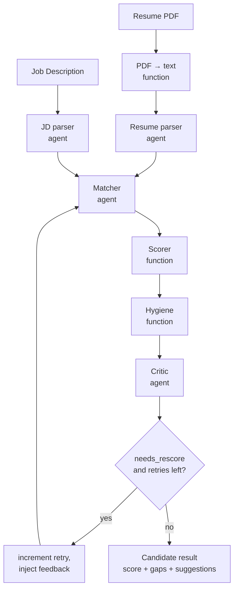
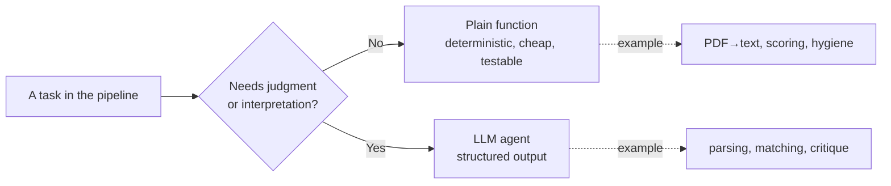
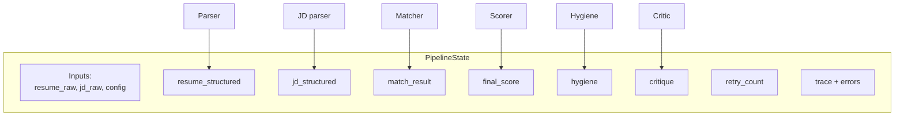
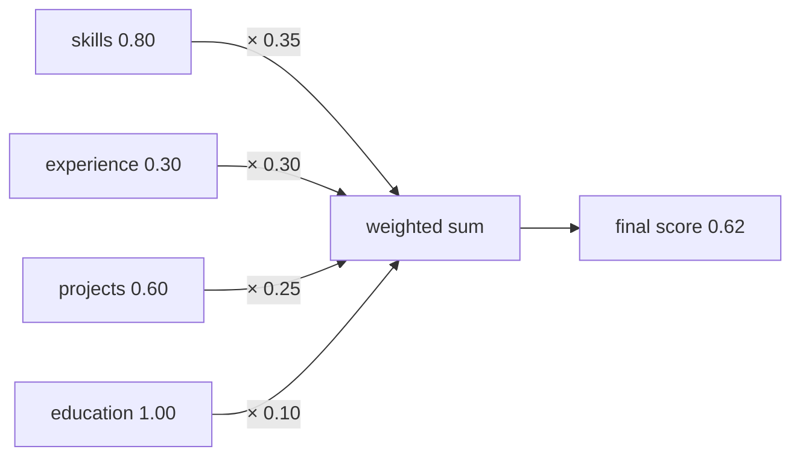
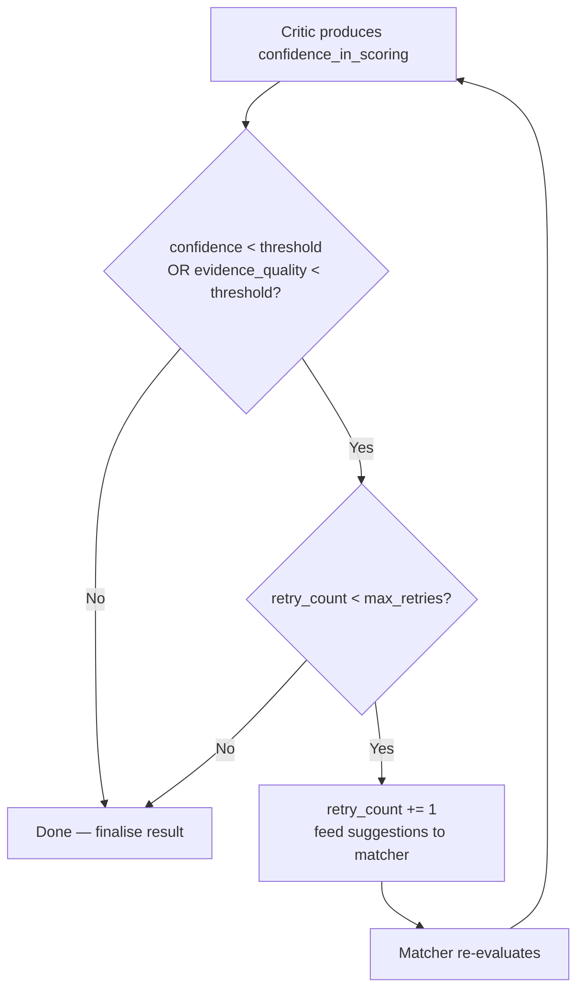
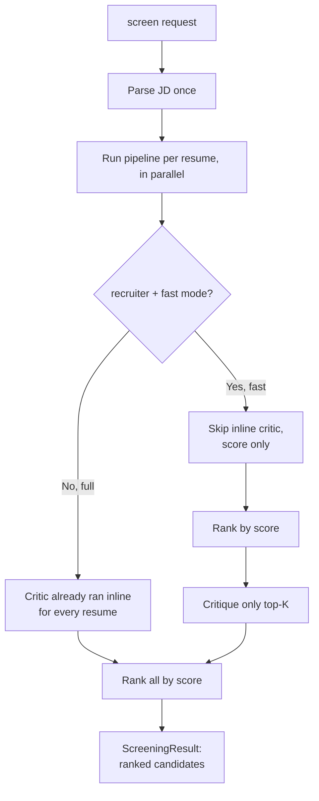
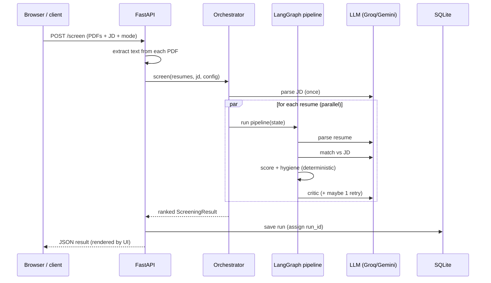
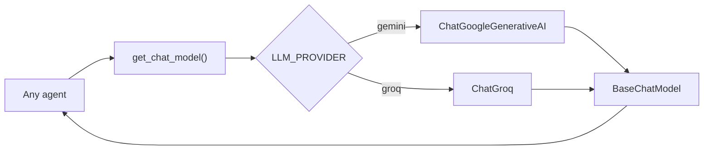
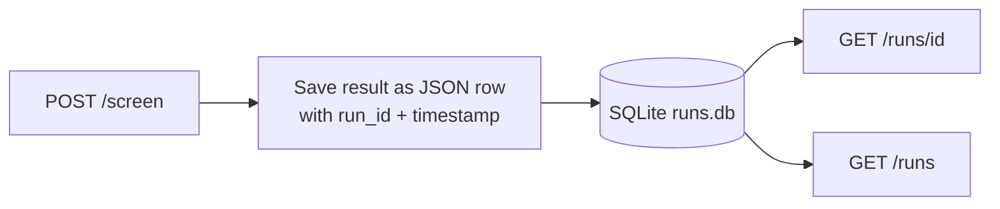
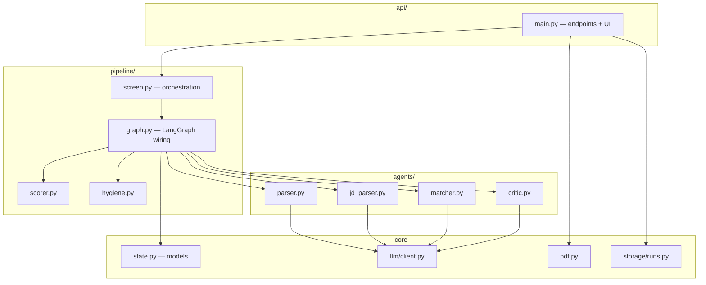

# CV-Align-Agents — Features & How It Works

A complete guide to what CV-Align-Agents does and how it works internally.
Part 1 lists every feature. Part 2 explains the mechanics with flowcharts.

> The diagrams below use [Mermaid](https://mermaid.js.org/), which GitHub renders
> automatically. If you are reading this somewhere that does not render Mermaid,
> the surrounding text describes each diagram.

---

# Part 1 — Features

## 1. Two personas, one engine

| Persona | Mode | What you give | What you get |
|---------|------|---------------|--------------|
| **Candidate** | `candidate` | 1 resume + a job description | A fit score plus gaps and concrete suggestions to improve your CV for that job |
| **Recruiter** | `recruiter` | N resumes + 1 job description | A ranked shortlist, each with a score, evidence, and a verdict |

Both personas run the **same** underlying pipeline; only the orchestration around
it differs.

## 2. Six-stage agentic pipeline

Each resume flows through six specialised stages. A stage is a plain **function**
when the task is deterministic, and an **LLM agent** only when the task needs
judgment — this keeps cost down and behaviour reproducible.

| # | Stage | Type | Responsibility |
|---|-------|------|----------------|
| 1 | **PDF → text** | function | Extract raw text from the uploaded PDF |
| 2 | **Resume parser** | agent | Turn resume text into structured fields |
| 3 | **JD parser** | agent | Turn the job description into structured requirements |
| 4 | **Matcher** | agent | Score each section vs the JD, with quoted evidence |
| 5 | **Scorer** | function | Combine sub-scores into one deterministic weighted score |
| 6 | **Hygiene** | function | Objective resume-quality checks (links, numbers, etc.) |
| 7 | **Critic** | agent | Gaps, suggestions, verdict, and a confidence check |

## 3. Per-section scoring with evidence

Instead of one opaque number, the matcher scores **four sections independently**:

- **skills** (default weight 35%)
- **experience** (30%)
- **projects** (25%)
- **education** (10%)

Every section comes with **quoted evidence** from the resume and a one–two
sentence **reason**, so you can always see *why* a score was given.

## 4. Deterministic, tunable final score

The final score is a plain weighted sum — not an LLM guess:

```
final = (0.35 × skills) + (0.30 × experience) + (0.25 × projects) + (0.10 × education)
```

- **Reproducible** — same input always gives the same number.
- **Tunable** — weights can be overridden per request and are automatically
  normalised to sum to 1.0, so the score always stays within `[0, 1]`.
- **Auditable** — the response includes the exact weights and the per-section
  breakdown used.

## 5. JD-aware matching (the key differentiator)

The score reflects fit against **this specific job**, not a generic resume
rubric. The matcher knows the JD's required vs nice-to-have skills, minimum years
of experience, responsibilities, and qualifications, and judges the candidate
against them.

## 6. Self-correction loop

After scoring, the critic reports its **confidence** that the scores are
well-justified. If confidence (or the matcher's evidence quality) is below a
threshold, the pipeline loops **back to the matcher once** for a more careful
re-evaluation, feeding the critic's suggestions in as guidance. The retry is
hard-capped (default 1) so it can never loop forever.

## 7. Resume hygiene checks (deterministic, zero-LLM)

Objective, rule-based checks that are independent of the job description:

- Missing email / GitHub / LinkedIn links
- Placeholder or example URLs (e.g. `example.com`, `TODO`)
- Thin or missing skills list
- Missing projects, or generic project names (e.g. "Project 1")
- Experience bullets without quantified impact (no numbers)
- Missing education section

These produce a **hygiene score** (0–1) plus a list of issues. Hygiene is
**advisory**: it informs the critic's suggestions and is shown to the candidate,
but it does **not** change the JD-match score (keeping that score purely about
job fit).

## 8. Critic feedback

For each candidate the critic returns:

- **gaps** — specific JD requirements the candidate does not clearly meet
- **suggestions** — actionable advice (including relevant hygiene fixes)
- **verdict** — `strong_fit`, `moderate_fit`, or `weak_fit`
- **confidence_in_scoring** — drives the self-correction decision

## 9. Cost controls (fast vs full critic)

| Critic mode | Behaviour | When to use |
|-------------|-----------|-------------|
| `full` | Critique **every** resume | Candidate mode, or small batches |
| `fast` | Score everyone, critique only the **top-K** | Large recruiter batches — saves LLM calls |

`critic_top_k` (default 5) controls how many top candidates get critiqued in fast
mode.

## 10. Parallel screening

In recruiter mode the JD is parsed **once** and reused across all resumes, and
the resumes are processed **concurrently** (`asyncio`). This is faster and avoids
the order-bias you would get from stuffing many resumes into one LLM call.

## 11. Provider-agnostic LLM

The LLM is chosen by configuration, not hard-coded. Switching providers is a
one-line env change with **zero code changes**:

| Provider | Default model | Free-tier headroom |
|----------|---------------|--------------------|
| **Gemini** | `gemini-2.5-flash` | ~20 requests/day |
| **Groq** | `llama-3.3-70b-versatile` | ~14,400 requests/day |

The live demo runs on Groq for headroom.

## 12. Explainability / audit trail

Every run records a **trace** — one entry per stage that executed (with notes
like `score=0.62` or `retry=1`). Combined with per-section evidence, this makes
any result fully explainable and debuggable.

## 13. Run persistence

Every screening run is saved to **SQLite** with a unique `run_id`, so results can
be retrieved or listed later. No external database to set up.

## 14. HTTP API

| Method | Path | Description |
|--------|------|-------------|
| `GET` | `/` | Web UI (single page) |
| `GET` | `/health` | Liveness check |
| `POST` | `/screen` | Screen resume PDF(s) against a JD; returns ranked results |
| `GET` | `/runs/{id}` | Retrieve a stored run |
| `GET` | `/runs` | List recent runs |
| `GET` | `/docs` | Interactive Swagger UI |

## 15. Web UI

A clean, dependency-free single-page frontend (served by the API itself):
job-description box, mode and critic toggles, multi-PDF upload, and a results
view with score, verdict badge, per-section breakdown bars, gaps, suggestions,
and hygiene. No build step, no frameworks.

## 16. Robust input handling

- Clear `422` errors for empty JD, missing files, unreadable PDFs, or invalid
  mode values.
- `503` with a helpful message if the LLM key is missing/misconfigured.
- Empty or image-only PDFs are handled without crashing.

## 17. Tested and linted

70 offline tests (using a fake LLM, so no API key or network is needed to run
them) plus `ruff` linting. Every stage was also verified live against a real LLM.

## 18. One-command deployment

Ships with a `Dockerfile` and a Hugging Face Spaces config (and a Render
blueprint). The whole app — API + UI + storage — runs from a single container.

---

# Part 2 — How It Works

## 2.1 High-level pipeline

For a single resume, the stages run in order, with one optional loop back to the
matcher driven by the critic:



**Why this shape:**

- The **parser** is separate from the **matcher** so one resume can be parsed
  once and matched against many jobs (or reused across a batch).
- The matcher returns **sub-scores + evidence**, not a final number, so scoring
  stays deterministic and tunable.
- The **scorer** is a pure function — the final number is always provable.
- The **critic** runs last and gates the self-correction loop.

## 2.2 Function vs. agent decision

The single most important design rule: use an LLM only when judgment is required.



This keeps the system cheap (fewer LLM calls), reproducible (deterministic where
possible), and genuinely "agentic" only where it adds value.

## 2.3 The shared state

Every stage reads from and writes to one shared, typed object —
`PipelineState`. It starts with just the inputs and accumulates results as the
pipeline runs:



Using explicit Pydantic models (not loose dicts) means the framework validates
the data passing between stages, and the whole pipeline is self-documenting.

## 2.4 Scoring math

The matcher emits one sub-score per section; the scorer combines them.



Worked example:
`(0.80×0.35) + (0.30×0.30) + (0.60×0.25) + (1.00×0.10) = 0.62`.

Weights can be overridden per request; they are re-normalised to sum to 1.0, so
the final score is always between 0 and 1.

## 2.5 The self-correction loop

The decision to loop is **deterministic** — the LLM provides a confidence number,
but the *rule* that acts on it lives in code (so the behaviour is predictable and
tunable):



- Default `confidence_threshold` = 0.6, default `max_retries` = 1.
- On the retry pass, the matcher receives the critic's suggestions as extra
  guidance, so the second attempt is better grounded.
- The cap guarantees the loop always terminates.

## 2.6 Two-mode orchestration

Above the single-resume pipeline sits the orchestration layer that handles
candidate vs recruiter and fast vs full critic:



- **full** mode: the critic runs inside each resume's pipeline.
- **fast** mode: all resumes are scored first, then only the top-K are critiqued —
  saving LLM calls on large batches.
- Either way, the JD is parsed once and resumes run concurrently.

## 2.7 Request lifecycle (API → result)

What happens end-to-end when the UI (or a `curl`) calls `POST /screen`:



## 2.8 Provider abstraction

Agents never import a concrete LLM class. They ask a factory for a model, and the
factory reads configuration to decide which provider to build:



Because every provider implements the same `BaseChatModel` interface (with
`.with_structured_output()`), switching providers is purely a config change.

## 2.9 Persistence and retrieval



Each run is stored as a single JSON row keyed by `run_id`. A fresh connection is
opened per operation, which keeps the store safe to use from the API's worker
threads.

## 2.10 Component map

How the source modules relate:



---

## Summary

CV-Align-Agents combines **deterministic functions** (PDF extraction, scoring,
hygiene) with **LLM agents** (parsing, matching, critique) in a LangGraph
pipeline that is JD-aware, self-correcting, explainable, and provider-agnostic —
served through a tested HTTP API with a simple web UI and SQLite persistence.
